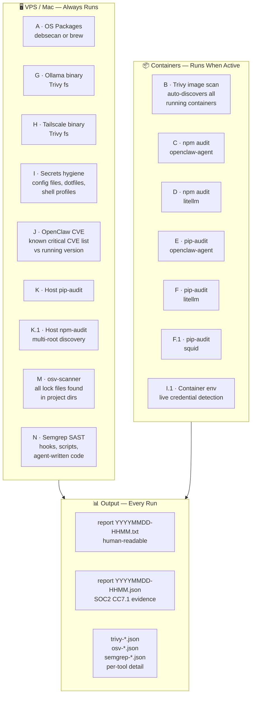
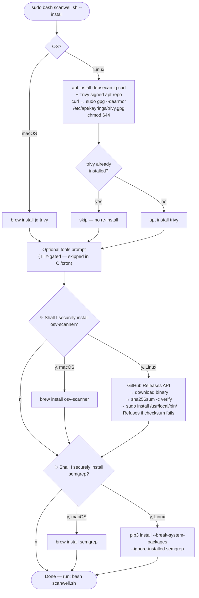

# 🔍 ScanWell — Full-Stack AI Agent Security Scanner

> **Free. Open source. No dashboard required.**
> Part of the [AgentShield Core](https://github.com/agentshield-ai/agentshield-core) stack.

---

## Who It's For

ScanWell is for developers and operators who run **self-hosted AI agents** and need to know their full security posture — not just one layer of it.

Specifically, you if you are:

- Running **OpenClaw, Open WebUI, LiteLLM, or any containerized AI agent stack** on a VPS or server
- A **macOS developer** who wants to audit their local AI dev environment before shipping
- A team moving toward **SOC2 or ISO27001 compliance** and need reproducible evidence trails
- Anyone who has ever had a **package silently poison a running service** and never wants that again

> ⚠️ This project was built after a bad Python library poisoned a running LiteLLM container in production — silently, with no alert, no scan, and no evidence trail. ScanWell is the tool we wished existed.

---

## The Problem: Point Scanners Leave Gaps

Most security tools scan one layer. Real AI agent deployments have many.

```
┌─────────────────────────────────────────────────────────────────┐
│                    A Self-Hosted AI Agent Stack                 │
│                                                                 │
│  ┌──────────┐   ┌──────────┐   ┌──────────┐   ┌────────────┐    │
│  │  Ubuntu  │   │  Trivy   │   │  OSV /   │   │  Semgrep   │    │
│  │    OS    │   │ covers   │   │  npm     │   │  covers    │    │
│  │ packages │   │ this ↓   │   │  audit   │   │  this ↓    │    │
│  └────┬─────┘   │          │   │ covers   │   │            │    │
│       │         │          │   │  this ↓  │   │            │    │
│  ┌────▼─────────▼──────────▼───▼──────────▼───▼────────┐   │    │
│  │ openclaw-agent container                            │   │    │
│  │   ├── OpenClaw (Node.js)                            │   │    │
│  │   ├── Python tools (bandit, semgrep, pip-audit)     │   │    │
│  │   └── Plugin runtime deps                           │   │    │
│  ├─────────────────────────────────────────────────────│   │    │
│  │ litellm container         squid container           │   │    │
│  ├─────────────────────────────────────────────────────│   │    │
│  │ Host: Ollama    Tailscale    Scripts    Config files│   │    │
│  └─────────────────────────────────────────────────────│   │    │
│       ↑                                                │   │    │
│  No single tool covers all of this.                    │   │    │
└─────────────────────────────────────────────────────────────────┘
```

**ScanWell runs all the scanners, in sequence, against every layer, and produces a single unified report.**

---

## What ScanWell Scans

### Complete Coverage Map

```
┌─────────────────────────────────────────────────────────────────────┐
│  ScanWell — 15 Scan Sections                                        │
│                                                                     │
│  ── HOST LAYER ──────────────────────────────────────────────────   │
│  A  OS Packages       debsecan (Ubuntu) / brew list (macOS)         │
│  G  Ollama Binary     Trivy filesystem scan                         │
│  H  Tailscale Binary  Trivy filesystem scan + version log           │
│  I  Secrets Hygiene   Pattern grep: sk-or-, sk-ant-, AKIA, PEM keys │
│  J  Agent CVE Check   Known critical CVEs vs running version        │
│  K  Host pip-audit    Python packages on VPS host                   │
│  K.1 Host npm-audit   All global npm roots + project dirs           │
│  M  osv-scanner       Multi-ecosystem lock files (all roots)        │
│  N  Semgrep SAST      Code security: hooks, scripts, agent code     │
│                                                                     │
│  ── CONTAINER LAYER (when running) ─────────────────────────────    │
│  B  Container Images  Trivy — auto-discovers all running containers │
│  C  Agent npm audit   npm audit inside openclaw-agent               │
│  D  LiteLLM npm       npm audit inside litellm container            │
│  E  Agent pip-audit   pip-audit inside openclaw-agent               │
│  F  LiteLLM pip       pip-audit inside litellm container            │
│  F.1 Squid pip        pip-audit inside squid container              │
│  I.1 Container Env    Scans live env vars for credential values     │
│                                                                     │
│  ── REPORTING ───────────────────────────────────────────────────   │
│  L  AgentShield CP    Optional upload to control plane dashboard    │
└─────────────────────────────────────────────────────────────────────┘
```

### What Gets Scanned Where



---

## ScanWell vs Alternatives

No single tool comes close to the coverage ScanWell provides out of the box.

| Capability                        | ScanWell | GitHub OSV | Trivy alone | Snyk | Manual scans |
|---|:---:|:---:|:---:|:---:|:---:|
| **OS packages (debsecan)**               | ✅ |    ❌    | ❌      | ❌      | ❌ |
| **Container image CVEs**                 | ✅ |    ❌    | ✅      | ✅      | varies |
| **Auto-discovers all containers**        | ✅ |    ❌    | manual   | manual  | ❌ |
| **npm deps (inside containers)**         | ✅ |    ❌    | partial  | ✅      | ❌ |
| **pip deps (inside containers)**         | ✅ |    ❌    | partial  | ✅      | ❌ |
| **Host binary CVEs (Ollama, Tailscale)** | ✅ |    ❌    | manual   | ❌      | ❌ |
| **Secrets hygiene (plaintext keys)**     | ✅ |    ❌    | partial  | partial | ❌ |
| **Container env credential scan**        | ✅ |    ❌    | ❌       | ❌     | ❌ |
| **Known agent CVE version check**        | ✅ |    ❌    | ❌       | ❌     | ❌ |
| **Multi-ecosystem lock files (osv)**     | ✅ |    ✅    | ❌       | ✅     | ❌ |
| **SAST code analysis (semgrep)**         | ✅ |    ❌    | ❌       | partial | separate tool |
| **Scans agent-written code**             | ✅ |    ❌    | ❌       | ❌     | ❌ |
| **Works without containers running**     | ✅ |    ✅    | partial  | ✅      | varies |
| **macOS + Linux unified**                | ✅ |    ✅    | ✅       | ✅     | ❌ |
| **SOC2 JSON evidence output**            | ✅ |    ❌    | ❌       | partial | ❌ |
| **Secure install (checksum verified)**   | ✅ |    n/a    | n/a      | n/a     | ❌ |
| **Free, no account required**            | ✅ |    ✅    | ✅       | partial | ✅ |

### Why GitHub's Built-in OSV Scanning Isn't Enough

GitHub's Dependabot and OSV scanning are excellent for repository source code. But they:

- **Only see what's in your repo** — not what's running in your containers
- **Miss the OS layer** — Ubuntu packages aren't in your package.json
- **Miss runtime-only deps** — plugin deps staged at runtime don't have lock files committed
- **Don't scan secrets in live container environment variables**
- **Can't check the binary version of Ollama or Tailscale** running on your host

### Why Trivy Alone Isn't Enough

Trivy is excellent at what it does. But alone it:

- **Doesn't run semgrep SAST** — won't catch injection flaws in your hook handlers
- **Doesn't scan your host Python/npm packages** installed outside containers
- **Doesn't detect plaintext secrets** in config files or shell profiles
- **Requires you to know which images to scan** — ScanWell auto-discovers all running containers

---

## Install

### Requirements


| Tool | Required | Purpose | Auto-installed |
|------|-----------|----------------|----------------|
| `bash` 4.0+| ✅ | Script runtime | — |
| `trivy` | ✅ | Container + binary CVE scanning | ✅ `--install` |
| `jq` | ✅ | JSON parsing | ✅ `--install` |
| `debsecan` | Linux only | OS package CVEs | ✅ `--install` |
| `curl` | Linux | Secure downloads | ✅ `--install` |
| `osv-scanner` | Optional | Multi-ecosystem dep CVEs | ✅ prompted |
| `semgrep` | Optional | SAST code analysis | ✅ prompted |


Tool,Status,Purpose,Auto-Installation
bash 4.0+,✅,Script runtime & logic,—
trivy,✅,Container & binary CVE scanning,✅ --install
jq,✅,JSON stream processing,✅ --install
debsecan,🐧,OS package vulnerability audits,✅ --install
curl,🐧,Secure data & asset retrieval,✅ --install
osv-scanner,🔍,Multi-ecosystem dependency audits,Interactive
semgrep,🛡️,Static Analysis (SAST) for code,Interactive

### Linux (Debian/Ubuntu VPS)

```bash
# Download
curl -fsSL https://raw.githubusercontent.com/agentshield-ai/agentshield-core/main/scanwell.sh \
  -o scanwell.sh && chmod +x scanwell.sh

# Install required tools (securely — signed repos, verified binaries)
sudo bash scanwell.sh --install
```

During `--install`, you'll be prompted for optional deeper-scan tools:

```
════════════════════════════════════════════════════════════════
 Optional tools for deeper scanning
════════════════════════════════════════════════════════════════
 ✨ Shall I securely install osv-scanner for more thorough scanning reports? [y/N]
 ✨ Shall I securely install semgrep for more thorough scanning reports? [y/N]
```

**osv-scanner** is installed from GitHub Releases with SHA256 checksum verification — the binary is refused if verification fails. **semgrep** is installed via PyPI over TLS.

### macOS

```bash
# Homebrew required — install from https://brew.sh if needed
curl -fsSL https://raw.githubusercontent.com/agentshield-ai/agentshield-core/main/scanwell.sh \
  -o scanwell.sh && chmod +x scanwell.sh

bash scanwell.sh --install
```

On macOS, all tools install via Homebrew (verified bottle checksums + GPG signatures). No sudo required.

### Install Flow



---

## Usage

### Basic Scan

```bash
# As non-root (recommended for regular runs)
bash scanwell.sh

# As root — uses system log paths (/var/log/scanwell/)
sudo bash scanwell.sh
```

### First Run — Configuration Prompt

On TTY (interactive terminal), ScanWell asks you to confirm its target directories before scanning. In cron or CI, this is auto-skipped.

```
════════════════════════════════════════════════════════════════
 scanwell.sh v7.3 — Confirm Configuration
════════════════════════════════════════════════════════════════
  OPENCLAW_USER       = openclaw
  ADMIN_USER          = lord
  OPENCLAW_DOCKER_DIR = /home/openclaw/openclaw-docker
  DOPPLER_TOKEN_FILE  = /home/openclaw/.doppler/service-token
  OPENCLAW_HOME       = /home/openclaw
  ADMIN_HOME          = /home/lord

 Correct? [Y/n]
```

Override any value with environment variables:

```bash
OPENCLAW_USER=myagent ADMIN_USER=me bash scanwell.sh
```

### Run Without OpenClaw

ScanWell works on any Linux VPS or macOS machine — OpenClaw is optional. When containers aren't running, all container sections skip gracefully and host-layer scans continue:

```bash
# On a macOS dev machine with no containers
bash scanwell.sh

# Sections A (brew), G (Ollama if present), H (Tailscale if present),
# I (secrets), J (agent CVE check), K, K.1, M, N all run normally.
# Sections B, C, D, E, F, F.1, I.1 print a one-line skip message.
```

### Runtime Behavior by Environment

```
┌──────────────────────────────────────────────────────────────────┐
│  Environment                 │  What runs                        │
├──────────────────────────────┼───────────────────────────────────┤
│  VPS + containers running    │  All 15 sections                  │
│  VPS + containers stopped    │  A, G, H, I, I.1(skip), J, K,    │
│                              │  K.1, M, N, L                     │
│  macOS dev machine           │  A(brew), G, H, I, J, K, K.1,    │
│                              │  M, N, L (no debsecan, no contrs) │
│  macOS + Docker Desktop      │  Full container scan if running    │
│  CI / cron (no TTY)          │  All applicable, no prompts       │
└──────────────────────────────┴───────────────────────────────────┘
```

### Log Output Location

| Context | Report location |
|---|---|
| macOS (any user) | `~/Library/Logs/scanwell/` |
| Linux, non-root | `~/.local/share/scanwell/logs/` |
| Linux, sudo / root | `/var/log/scanwell/` |

### Cron — Weekly Automated Scan

```bash
# Add to crontab (as the admin user)
0 2 * * 0 bash /path/to/scanwell.sh >> /tmp/scanwell-cron.log 2>&1
```

---

## Scan Sections Reference

### A — OS Packages

**Linux:** `debsecan --suite <codename>` against the running Ubuntu suite (auto-detected via `lsb_release`). Reports packages with available security fixes.

**macOS:** `brew list` package count logged; run `softwareupdate --list` manually for OS patches. debsecan is Linux-only.

---

### B — Container Images (Trivy)

Auto-discovers **all running containers** via `podman ps` or `docker ps` — not hardcoded to OpenClaw names. Works with any container stack.

```
┌─────────────────────────────────────────────────────────────┐
│  Container auto-discovery                                   │
│                                                             │
│  podman/docker ps                                           │
│    → openclaw-agent   → localhost/openclaw-local:latest     │
│    → openclaw-litellm → localhost/openclaw-litellm-hard..   │
│    → openclaw-squid   → docker.io/ubuntu/squid:latest       │
│    → [any other containers you're running]                  │
│                                                             │
│  Each → Trivy image scan (CRITICAL, HIGH, MEDIUM, LOW)     │
│  Fallback: tarball mode if no socket available              │
└─────────────────────────────────────────────────────────────┘
```

Trivy scans container image layers — catches CVEs in base images, language runtime packages, and OS packages baked into the image.

---

### C / D — npm audit (containers)

Runs `npm audit --json` inside the agent and LiteLLM containers. Catches CVEs in Node.js dependencies that Trivy may miss (Trivy covers image layers; npm audit hits the lockfile graph).

> ENOLOCK is expected for globally-installed packages — logged as informational, not an error. Trivy covers those.

---

### E / F / F.1 — pip-audit (containers)

Runs `pip-audit --format json` inside each container that has pip-audit installed. Catches CVEs in Python packages in the running container environment.

> This is what would have caught the LiteLLM poisoning incident.

---

### G / H — Host Binaries (Trivy fs)

Scans the Ollama and Tailscale binaries on the VPS host using `trivy fs`. Catches CVEs in the binary's bundled Go dependencies.

---

### I — Secrets Hygiene

Scans config files, dotfiles, shell profiles, and the agent workspace for plaintext credential patterns:

| Pattern | Catches |
|---|---|
| `sk-or-[a-zA-Z0-9]{20,}` | OpenRouter API keys |
| `sk-ant-[a-zA-Z0-9-]{20,}` | Anthropic API keys |
| `sk-[a-zA-Z0-9]{20,}` | Generic API keys |
| `AKIA[0-9A-Z]{16}` | AWS access keys |
| `-----BEGIN.*PRIVATE KEY` | PEM private keys |

Scans across: docker-compose dir, agent workspace memory, admin home, openclaw home, Doppler token dir, shell profiles (`.bashrc`, `.zshrc`, `.profile`).

---

### I.1 — Container Environment Scan

Reads live environment variables from running containers and checks their VALUES (not names) against credential patterns. Catches secrets injected at runtime that won't appear in any file scan.

---

### J — OpenClaw Version CVE Check

Checks the running OpenClaw version against a curated list of known critical CVEs. Fetches a live feed from AgentShield (falls back to baked-in list if unavailable):

```
┌─────────────────────────────────────────────────────────┐
│  Known Critical CVEs (sample)                           │
│                                                         │
│  CVE-2026-32915  → fixed in 2026.3.11  (CVSS 9.3)     │
│  CVE-2026-32918  → fixed in 2026.3.11  (CVSS 9.2)     │
│  CVE-2026-22172  → fixed in 2026.3.12                  │
│  CVE-2026-32987  → fixed in 2026.3.13                  │
│  ...                                                    │
└─────────────────────────────────────────────────────────┘
```

Falls back to checking the host-installed `openclaw` binary if the container isn't running.

---

### K / K.1 — Host pip-audit + npm-audit

**K:** Runs `pip-audit` against the VPS host Python environment.

**K.1:** Auto-discovers all npm global roots (current user, root, nvm, common paths) and project directories with `package.json`, then runs `npm audit` against each:

```
  Found npm global root: /usr/local/lib/node_modules
  Found npm global root: /home/openclaw/.local/lib/node_modules
  Found package.json: /home/openclaw/openclaw-docker/openclaw-data/plugin-runtime-deps/
  ...
```

---

### M — osv-scanner (Multi-ecosystem)

Runs `osv-scanner scan -r` across auto-discovered project directories. osv-scanner checks against the OSV database and finds vulnerabilities in:
- `package-lock.json` / `yarn.lock` (Node.js)
- `requirements.txt` / `Pipfile.lock` / `poetry.lock` (Python)
- `go.sum` (Go)
- And more

**Path discovery** — scan roots are built automatically:

```
┌─────────────────────────────────────────────────────────────┐
│  Code scan root discovery                                   │
│                                                             │
│  1. OPENCLAW_DOCKER_DIR  (/home/openclaw/openclaw-docker)   │
│  2. ADMIN_HOME           (/home/lord)                       │
│  3. $PWD (if not already covered)                           │
│  4. Git repos found via: find ~ -name ".git" -maxdepth 5   │
│                                                             │
│  Deduplication:                                             │
│  • Skip if new path is child of existing root               │
│  • Skip if new path is PARENT of existing root              │
│    (prevents 20GB Podman overlay from being walked          │
│     when openclaw-docker is already in scope)               │
└─────────────────────────────────────────────────────────────┘
```

---

### N — Semgrep SAST

Runs `semgrep scan --config auto` with ERROR and WARNING severity across code roots. Catches security issues in:

- Startup scripts (`startup.sh`, `proxy-init.js`)
- Docker configuration (`Dockerfile`, `docker-compose.yml`)
- Custom hook handlers (TypeScript/JavaScript)
- Agent-written code in the workspace

**Smart exclusions** — skips directories that would produce noise or take forever:

```
Excluded from semgrep:
  .local          — Podman overlay layers (20GB+)
  .npm            — npm download cache
  node_modules    — third-party code
  openclaw-deps   — dependency staging
  plugin-runtime-deps  — staged plugin node_modules
  memory, completions, agents, tasks, flows, cron,
  media, devices, session-delivery-queue, subagents,
  browser, qqbot  — agent runtime state directories
```

---

### L — AgentShield Control Plane Upload

```bash
# Enable uploads by setting your API key
AGENTSHIELD_API_KEY=your-key bash scanwell.sh
```

Without a key, ScanWell prints a free-tier notice and exits cleanly. Findings stay local.

With a key, scan results upload to the AgentShield dashboard for:
- Trending over time
- Cross-stack CVE comparison
- Automated alerts
- SOC2 evidence export

---

## Output & Evidence

Every scan produces:

```
~/.local/share/scanwell/logs/
  20260428-1700.txt          ← human-readable report
  20260428-1700.json         ← structured JSON (SOC2 CC7.1)
  20260428-1700-trivy-openclaw-agent.json
  20260428-1700-trivy-litellm.json
  20260428-1700-osv-openclaw-docker.json
  20260428-1700-semgrep-openclaw-docker.json
  ...
```

### JSON Evidence Format

```json
{
  "scan_timestamp": "2026-04-28T17:00:00Z",
  "host": "srv1417102",
  "summary": {
    "critical": 0,
    "high": 2,
    "medium": 4,
    "low": 11,
    "scan_errors": 0
  },
  "findings": [
    {
      "layer": "osv-scan",
      "severity": "HIGH",
      "package": "openclaw-docker",
      "id": "osv-scanner",
      "desc": "3 dependency vulnerabilities in /home/openclaw/openclaw-docker"
    }
  ],
  "soc2_evidence": {
    "control": "CC7.1",
    "result": "FINDINGS",
    "report_path": "/home/lord/.local/share/scanwell/logs/20260428-1700.txt"
  }
}
```

---

## Configuration Reference

### Environment Variables

| Variable | Default | Purpose |
|---|---|---|
| `OPENCLAW_USER` | `openclaw` | User owning the Podman containers |
| `ADMIN_USER` | `lord` | Admin user running the script |
| `OPENCLAW_DOCKER_DIR` | `/home/$OPENCLAW_USER/openclaw-docker` | Container stack directory |
| `DOPPLER_TOKEN_FILE` | `/home/$OPENCLAW_USER/.doppler/service-token` | Doppler token location |
| `AGENTSHIELD_API_KEY` | _(unset)_ | Enables CP upload |
| `AGENTSHIELD_CVE_FEED` | AgentShield GitHub URL | Override CVE feed URL |
| `AGENTSHIELD_API_ENDPOINT` | `https://api.agentshield.ai/v1/scans` | Override upload endpoint |

### Runtime Paths (auto-selected)

| Context | Log dir | Trivy cache |
|---|---|---|
| macOS | `~/Library/Logs/scanwell/` | `~/.cache/trivy` |
| Linux, non-root | `~/.local/share/scanwell/logs/` | `~/.cache/trivy` |
| Linux, root/sudo | `/var/log/scanwell/` | `/var/cache/trivy` |

---

## macOS Compatibility

ScanWell runs natively on macOS with no modification. Sections adapt automatically:

```
┌────────────────────────────────────────────────────────────────┐
│  macOS behavior                                                │
├────────────────────────────────────────────────────────────────┤
│  A  OS packages     brew list (package count)                  │
│                     debsecan — gracefully skipped              │
│                     Tip: run 'softwareupdate --list'           │
│  B  Containers      Docker Desktop auto-detected               │
│                     Podman Desktop: socket path differs —      │
│                     may skip container scan (non-blocking)     │
│  G  Ollama          Scanned if binary found at any path        │
│  H  Tailscale       Scanned if installed                       │
│  I  Secrets         Scans ~/Library, project dirs, dotfiles    │
│  K.1 npm            Finds nvm roots, Homebrew node, projects   │
│  M  osv-scanner     brew install osv-scanner                   │
│  N  semgrep         brew install semgrep                       │
│  Logs               ~/Library/Logs/scanwell/                   │
└────────────────────────────────────────────────────────────────┘
```

All tools installed on macOS go through Homebrew — bottle checksums and GPG signatures verified automatically. No manual key handling.

---

## Secure Install Design

ScanWell's install path follows the same verification standards it enforces in scans. Every tool installed uses a trusted, verifiable channel:

| Tool | Method | Verification |
|---|---|---|
| `trivy` (Linux) | Official signed apt repo | GPG key via `sudo gpg --dearmor -o /etc/apt/keyrings/trivy.gpg` |
| `trivy` (macOS) | Homebrew | Bottle checksum + GPG |
| `osv-scanner` (Linux) | GitHub Releases binary | SHA256 from `checksums.txt` — refused if fails |
| `osv-scanner` (macOS) | Homebrew | Bottle checksum + GPG |
| `semgrep` (Linux) | PyPI over TLS | pip verifies package hashes on download |
| `semgrep` (macOS) | Homebrew | Bottle checksum + GPG |

> **Never** `curl | bash`. Never an unverified binary. This is the standard we hold ourselves to, and it's the same standard ScanWell enforces when scanning your stack.

---

## FAQ

**Q: My OpenClaw containers aren't running. Is the scan still useful?**

Yes. All host-layer scans (A, G, H, I, J, K, K.1, M, N) run normally. Container sections print a one-line skip message and the scan continues. You still get OS CVEs, secrets hygiene, SAST, and dependency scanning.

**Q: I don't use OpenClaw. Can I still use ScanWell?**

Yes. Set `OPENCLAW_USER` to any user, and `OPENCLAW_DOCKER_DIR` to any container stack directory. Container auto-discovery finds whatever is running — it's not hardcoded to OpenClaw container names. The secrets and SAST scans work on any project layout.

**Q: Does ScanWell upload anything without my consent?**

No. Section L (AgentShield CP upload) only runs if `AGENTSHIELD_API_KEY` is set. Without it, the tool prints a free-tier notice and exits cleanly. Nothing leaves your machine.

**Q: Can I run this in CI?**

Yes. In non-TTY contexts (no interactive terminal), the configuration prompt and optional install prompts are automatically skipped. Set the config via environment variables and add to your pipeline.

**Q: How do I add this to cron for weekly scans?**

```bash
# Weekly scan every Sunday at 2am
0 2 * * 0 OPENCLAW_USER=openclaw ADMIN_USER=lord bash /home/lord/scanwell.sh
```

**Q: The semgrep scan is taking too long.**

ScanWell excludes known-large directories by default (Podman overlay layers, npm caches, agent runtime state). If you have unusually large project directories in scope, narrow them with the `OPENCLAW_DOCKER_DIR` env var or by adjusting `ADMIN_HOME`.

**Q: What's the difference between Section B (Trivy) and Section M (osv-scanner)?**

Trivy scans **container image layers** — it finds CVEs in OS packages and language runtimes baked into the image. osv-scanner reads **lock files** — it checks your declared dependencies against the OSV database. They catch different things and both matter.

---

## Part of AgentShield Core

ScanWell is the scanning component of the AgentShield open-source stack. The full stack includes:

- **Bridge networking** — kernel-enforced network isolation for containers
- **Squid allowlist** — domain whitelist enforcement for all outbound agent requests
- **NightWatchman** — auto-healing and SMS alerting for container health
- **Doppler integration** — runtime secrets injection, nothing on disk
- **ScanWell** — full-stack CVE and security scanner ← you are here

All components are MIT licensed and free to use without a dashboard. The [AgentShield Control Plane](https://agentshield.ai) adds dashboards, alerting, trending, and SOC2 evidence exports.

---

*ScanWell is maintained by [AgentShield](https://agentshield.ai) — security enforcement for self-hosted AI agents.*
